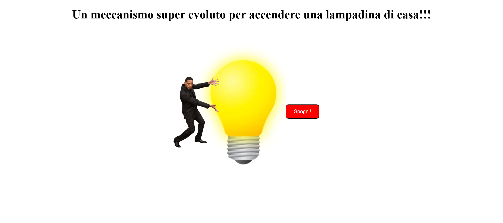

<h1 align="center">Primi passi col DOM</h1>

###

  
  
  
  
  
  
  

###

Consegna  Inseriamo in pagina l’immagine della lampadina spenta che trovate in allegato e accanto un bottone con la scritta “Accendi”.  Al click del bottone, la lampadina dovrà accendersi (dovremo quindi utilizzare l’immagine della lampadina accesa, sempre in allegato)  BONUS  Facciamo accendi e spegni:  Al primo click la lampadina si accende e nel bottone compare la scritta "Spegni" Al secondo click la lampadina si spegne e nel bottone compare la scritta "Accendi" E così via...  Per fare questo bonus potremmo aver bisogno di del metodo string.includes() 😉  

###

